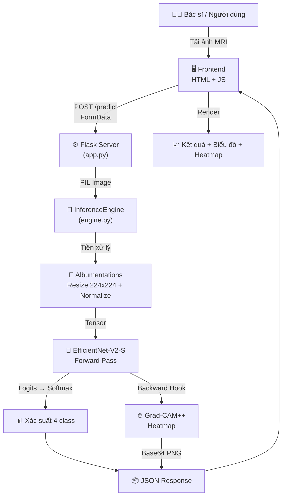

# 🎓 Hướng Dẫn Trình Bày Dự Án NeuroScan AI

> Tài liệu này giúp bạn **hiểu sâu từng phần code** và **chuẩn bị bài trình bày** trước hội đồng thầy cô.

---

## 📌 Tổng Quan Dự Án (Nói trong 2 phút đầu)

**NeuroScan AI** là hệ thống **phân loại khối u não từ ảnh MRI** sử dụng Deep Learning, gồm:

| Thành phần | Công nghệ | Vai trò |
|---|---|---|
| **AI Model** | EfficientNet-V2-S (PyTorch) | Phân loại 4 loại u não |
| **XAI** | Grad-CAM++ | Giải thích vùng AI quan sát |
| **Backend** | Flask (Python) | REST API xử lý ảnh |
| **Frontend** | HTML/CSS/JS | Giao diện kéo thả, hiển thị kết quả |
| **Deploy** | Docker | Đóng gói, triển khai |

**4 nhãn phân loại:**
1. 🟢 `notumor` — Không có u (Bình thường)
2. 🟡 `meningioma` — U màng não (Nguy cơ trung bình)
3. 🟣 `pituitary` — U tuyến yên (Nguy cơ trung bình)
4. 🔴 `glioma` — U thần kinh đệm (Nguy cơ cao)

---

## 📊 Kết Quả Training Thực Tế (SỐ LIỆU THẬT TỪ DỰ ÁN)

> [!IMPORTANT]
> Đây là số liệu thực tế từ checkpoint đã train. **Hãy thuộc lòng các con số này** vì thầy cô chắc chắn sẽ hỏi!

### 🏆 Kết Quả Chính

| Metric | Giá trị |
|---|---|
| **Best Validation Accuracy** | **99.42%** |
| **Training Accuracy (epoch cuối)** | 99.52% |
| **Số epochs đã train** | 31/50 (Early Stopping kích hoạt) |
| **Training mode** | Finetune (toàn bộ model) |
| **Mixed Precision** | Có (AMP) |

### 📈 Biểu Đồ Training (Loss & Accuracy)


**Cách giải thích cho thầy cô:**
- _"Biểu đồ bên trái: Loss giảm liên tục từ 0.84 xuống 0.46, cho thấy model hội tụ tốt"_
- _"Biểu đồ bên phải: Accuracy tăng từ 78% lên 99.5%, đường Train và Val gần nhau → model KHÔNG bị overfitting"_
- _"Val Accuracy cao hơn Train Accuracy ở các epoch đầu nhờ Transfer Learning — model pre-trained đã có kiến thức nền tốt"_
- _"Training dừng ở epoch 31/50 do Early Stopping — 10 epoch liên tiếp không cải thiện thêm"_

### 🔢 Confusion Matrix (Ma Trận Nhầm Lẫn)


**Cách giải thích cho thầy cô:**

| Class | Accuracy | Phân tích lỗi |
|---|---|---|
| **Meningioma** | **100%** 🏆 | Không nhầm lẫn, model nhận diện hoàn hảo |
| **Notumor** | **99.8%** | Chỉ 0.2% bị nhầm thành glioma |
| **Pituitary** | **99.7%** | Chỉ 0.3% bị nhầm thành meningioma |
| **Glioma** | **98.3%** | 1.3% nhầm thành meningioma, 0.3% nhầm thành pituitary |

> _"Glioma có accuracy thấp nhất (98.3%) vì đặc trưng hình ảnh của glioma đôi khi tương tự meningioma — đây cũng là thách thức trong lâm sàng thực tế khi bác sĩ cũng gặp khó khăn phân biệt 2 loại u này."_

### 📁 Phân Bố Dataset

| Tập dữ liệu | Glioma | Meningioma | No Tumor | Pituitary | Tổng |
|---|---|---|---|---|---|
| **Testing** | 300 | 306 | 405 | 300 | **1,311** |

> **Nguồn dữ liệu:** Kaggle Brain Tumor MRI Dataset (công khai, được dùng rộng rãi trong nghiên cứu)

### ⚙️ Hyperparameters Đã Sử Dụng

```json
{
  "img_size": 224,
  "batch_size": 32,
  "lr": 0.0001,
  "weight_decay": 0.0001,
  "dropout": 0.4,
  "label_smoothing": 0.1,
  "scheduler": "cosine",
  "mixed_precision": true,
  "gradient_clipping": 1.0,
  "early_stopping_patience": 10
}
```

---

## 🏗️ Kiến Trúc Hệ Thống — Sơ Đồ Luồng Hoạt Động



---

## 📂 Giải Thích Chi Tiết Từng File Code

### 1️⃣ `src/config.py` — Cấu Hình Trung Tâm

> **Câu nói khi trình bày:** _"File này chứa toàn bộ cấu hình hệ thống, giống như 'bảng điều khiển' của dự án."_

```python
IMG_SIZE = 224          # Kích thước ảnh đầu vào cho model (224×224 pixels)
NUM_CLASSES = 4         # Số lượng class (4 loại u não)
CLASS_NAMES = ["glioma", "meningioma", "notumor", "pituitary"]
CLASS_VI = {            # Dịch tên class sang tiếng Việt
    "glioma":     "U thần kinh đệm",
    "meningioma": "U màng não",
    "notumor":    "Không có u",
    "pituitary":  "U tuyến yên",
}
DEVICE = torch.device("cuda" if torch.cuda.is_available() else "cpu")
# → Tự phát hiện GPU NVIDIA, nếu không có thì dùng CPU
```

**Ý nghĩa quan trọng:**
- `IMG_SIZE = 224`: Đây là chuẩn ImageNet, mọi ảnh MRI đều được resize về 224×224 trước khi đưa vào model
- `DEVICE`: Hệ thống tự động sử dụng GPU nếu có, tăng tốc inference gấp 10-20 lần

---

### 2️⃣ `src/dataset.py` — Xử Lý Dữ Liệu & Data Augmentation

> **Câu nói khi trình bày:** _"File này xử lý việc đọc ảnh MRI và tăng cường dữ liệu (Data Augmentation) để model học tốt hơn."_

#### 🔑 Data Augmentation Pipeline (Phần QUAN TRỌNG nhất)

```python
def get_train_transforms(img_size):
    return A.Compose([
        A.Resize(img_size, img_size),              # Resize về 224×224
        A.HorizontalFlip(p=0.5),                   # Lật ngang (50% xác suất)
        A.VerticalFlip(p=0.2),                     # Lật dọc (20%)
        A.RandomRotate90(p=0.3),                   # Xoay 90° ngẫu nhiên
        A.ShiftScaleRotate(...),                   # Dịch chuyển + zoom + xoay nhẹ
        A.OneOf([GaussNoise, GaussianBlur, ...]),   # Thêm nhiễu/làm mờ
        A.OneOf([ElasticTransform, GridDistortion]),# Biến dạng đàn hồi
        A.CLAHE(clip_limit=2.0, ...),              # Cân bằng histogram (tăng tương phản)
        A.RandomBrightnessContrast(...),            # Thay đổi độ sáng/tương phản
        A.Normalize(mean=..., std=...),            # Chuẩn hóa theo ImageNet
        ToTensorV2(),                               # Chuyển thành Tensor PyTorch
    ])
```

**Giải thích cho thầy cô:**
- **Tại sao cần Augmentation?** → Dữ liệu y tế rất ít và đắt, augmentation giúp "nhân bản" dữ liệu với biến thể khác nhau, chống overfitting
- **CLAHE** đặc biệt hữu ích cho ảnh y tế vì nó tăng tương phản cục bộ, giúp model nhìn rõ hơn ranh giới khối u
- **Normalize theo ImageNet** vì model EfficientNet được pre-trained trên ImageNet

#### 🔑 Weighted Random Sampler (Xử lý dữ liệu mất cân bằng)

```python
def get_weighted_sampler(self):
    # Nếu class A có 1000 ảnh, class B có 200 ảnh
    # → Sampler sẽ lấy mẫu class B nhiều hơn để cân bằng
    class_weights = [total / (NUM_CLASSES * count) for count in self.class_counts]
```

**Giải thích:** Trong y tế, số ca bệnh thường ít hơn ca bình thường → dùng weighted sampler để model không bị "thiên vị" về class có nhiều dữ liệu.

---

### 3️⃣ `src/models/base.py` — Kiến Trúc Mạng Neural (TRỌNG TÂM)

> **Câu nói khi trình bày:** _"Đây là file định nghĩa kiến trúc mạng neural, sử dụng kỹ thuật Transfer Learning."_

#### 🔑 Cấu trúc Model chính: EfficientNet-V2-S

```python
def _build_efficientnet_v2_s(self, pretrained, dropout, num_classes):
    # Bước 1: Tải model EfficientNet-V2-S đã được pre-trained trên ImageNet
    weights = tv_models.EfficientNet_V2_S_Weights.IMAGENET1K_V1
    base = tv_models.efficientnet_v2_s(weights=weights)
    
    # Bước 2: Tách ra 2 phần
    self.feature_extractor = base.features     # Phần trích xuất đặc trưng (giữ nguyên)
    self.avgpool = base.avgpool                # Global Average Pooling
    
    # Bước 3: Thay thế Classifier Layer (head) cho bài toán 4 class
    in_features = base.classifier[-1].in_features  # = 1280
    self.classifier = nn.Sequential(
        nn.Dropout(dropout),           # Dropout 40% → chống overfitting
        nn.Linear(in_features, 256),   # Fully Connected: 1280 → 256
        nn.BatchNorm1d(256),           # Batch Normalization → ổn định training
        nn.SiLU(),                     # Activation function (Swish)
        nn.Dropout(dropout * 0.5),     # Dropout 20%
        nn.Linear(256, num_classes),   # Output layer: 256 → 4 classes
    )
    
    # Bước 4: Đánh dấu layer cuối để Grad-CAM hook vào
    self.gradcam_layer = self.feature_extractor[-1]
```

**Sơ đồ kiến trúc model để vẽ lên bảng:**

```
Ảnh MRI (224×224×3)
    │
    ▼
┌─────────────────────────┐
│  EfficientNet-V2-S      │  ← Pre-trained trên ImageNet (1.2M ảnh)
│  Feature Extractor      │  ← ĐÓNG BĂNG (freeze) khi mode="feature"
│  (Trích xuất đặc trưng) │
└─────────────────────────┘
    │ Feature Maps (7×7×1280)
    ▼
┌─────────────────────────┐
│  Global Average Pooling │  ← Nén 7×7 → 1×1
└─────────────────────────┘
    │ Vector (1280,)
    ▼
┌─────────────────────────┐
│  Classifier (Custom)    │  ← HUẤN LUYỆN MỚI cho bài toán u não
│  Dropout(0.4)          │
│  Linear(1280→256)      │
│  BatchNorm + SiLU      │
│  Dropout(0.2)          │
│  Linear(256→4)         │  ← Output: [glioma, meningioma, notumor, pituitary]
└─────────────────────────┘
    │
    ▼
  Softmax → Xác suất 4 class
```

#### 🔑 Transfer Learning — 3 chế độ huấn luyện

```python
def _apply_freeze_mode(self, mode, unfreeze_layers):
    if mode == "feature":
        # Đóng băng TOÀN BỘ feature extractor → chỉ train classifier
        for p in self.feature_extractor.parameters(): p.requires_grad = False
    elif mode == "partial":
        # Đóng băng phần lớn, mở 2 layer cuối
        ...
    # mode == "finetune" → Mở hết, train toàn bộ
```

**Giải thích cho thầy cô:**
- **Transfer Learning** = "Chuyển giao kiến thức". Model đã học nhận dạng hình ảnh trên 1.2 triệu ảnh ImageNet → giờ mình chỉ cần "dạy thêm" phần nhận diện u não
- **Feature mode**: Nhanh, ít data cũng OK, nhưng accuracy thấp hơn
- **Finetune mode**: Chậm hơn, cần nhiều data, nhưng accuracy cao nhất

---

### 4️⃣ `src/utils/gradcam.py` — Explainable AI (XAI) ⭐

> **Câu nói khi trình bày:** _"Đây là phần XAI — giúp bác sĩ hiểu TẠI SAO AI đưa ra kết luận đó, không phải hộp đen."_

#### 🔑 Grad-CAM cơ bản

```python
class GradCAM:
    def __init__(self, model, target_layer):
        # Hook vào layer cuối cùng của feature extractor
        self._register_hooks()
    
    def _register_hooks(self):
        # Forward hook: Bắt activations (đặc trưng) khi ảnh đi qua
        def forward_hook(module, input, output):
            self._activations = output.detach()
        
        # Backward hook: Bắt gradients (đạo hàm) khi backpropagation
        def backward_hook(module, grad_input, grad_output):
            self._gradients = grad_output[0].detach()
    
    def generate(self, input_tensor, class_idx):
        # 1. Forward pass → lấy activations
        output = self.model(input_tensor)
        
        # 2. Backward pass cho class cần giải thích → lấy gradients  
        score = output[0, class_idx]
        score.backward()
        
        # 3. Tính trọng số = trung bình gradient theo không gian
        weights = grads.mean(dim=(1, 2))
        
        # 4. Tổng có trọng số của activation maps → Heatmap
        cam = Σ(weight_i × activation_i)
        cam = ReLU(cam)  # Chỉ giữ vùng tác động dương
```

#### 🔑 Grad-CAM++ (phiên bản cải tiến — dự án dùng cái này)

```python
class GradCAMPlusPlus(GradCAM):
    def generate(self, input_tensor, class_idx):
        # Khác biệt: Dùng gradient bậc 2 và bậc 3 để tính trọng số
        grads_power_2 = grads ** 2
        grads_power_3 = grads ** 3
        
        # Alpha weights phức tạp hơn → chính xác hơn GradCAM thường
        alpha = grads² / (2·grads² + Σ(activations)·grads³ + ε)
        weights = Σ(alpha × ReLU(exp(score) × grads))
```

**Điểm khác biệt Grad-CAM vs Grad-CAM++:**

| | Grad-CAM | Grad-CAM++ |
|---|---|---|
| **Trọng số** | Trung bình gradient | Gradient bậc cao (α weights) |
| **Ưu điểm** | Đơn giản, nhanh | Chính xác hơn khi có nhiều vùng quan tâm |
| **Khi nào dùng** | Nhận diện vật thể đơn | Y tế — cần chính xác vùng tổn thương |

**Hình ảnh minh họa để giải thích:**
```
┌─────────────┐     ┌─────────────┐     ┌─────────────┐
│  Ảnh MRI    │  →  │  Heatmap    │  →  │  Overlay    │
│  Gốc        │     │ (đỏ=chú ý) │     │ (chồng lên) │
└─────────────┘     └─────────────┘     └─────────────┘
```

---

### 5️⃣ `src/inference/engine.py` — Inference Pipeline

> **Câu nói khi trình bày:** _"File này kết nối tất cả lại — tiền xử lý ảnh, chạy model, tạo heatmap, trả về kết quả."_

```python
class InferenceEngine:
    def predict(self, pil_image, gradcam_request="both"):
        # Bước 1: Tiền xử lý ảnh
        tensor, orig_np = self.preprocess(pil_image)
        # → Resize 224×224, Normalize, chuyển thành Tensor
        
        # Bước 2: Chạy inference qua model
        for name, model in self.models.items():
            logits = model(tensor)                          # Forward pass
            probs = F.softmax(logits, dim=1)                # Softmax → xác suất
        
        # Bước 3: Ensemble (nếu có nhiều model)
        ensemble_probs = np.mean(all_probs, axis=0)
        
        # Bước 4: Lấy kết quả
        pred_idx = np.argmax(ensemble_probs)                # Index class cao nhất
        pred_class = CLASS_NAMES[pred_idx]                  # Tên class
        confidence = ensemble_probs[pred_idx]               # Độ tin cậy
        
        # Bước 5: Tạo Grad-CAM++ heatmap
        cam, _, _ = self.gradcam_engines[name].generate(tensor, class_idx=pred_idx)
        overlay = apply_gradcam_overlay(orig_np, cam)       # Chồng heatmap lên ảnh gốc
        
        # Bước 6: Chuyển heatmap → Base64 (để gửi qua JSON)
        gradcam_images[name] = "data:image/png;base64," + base64.b64encode(...)
        
        # Trả về kết quả hoàn chỉnh
        return { "class", "class_vi", "confidence", "probabilities", "gradcam" }
```

---

### 6️⃣ `train.py` — Pipeline Huấn Luyện Model

> **Câu nói khi trình bày:** _"File này thực hiện quá trình huấn luyện model với các kỹ thuật tối ưu hiện đại."_

#### 🔑 Các kỹ thuật huấn luyện được sử dụng:

| Kỹ thuật | Mục đích | Code |
|---|---|---|
| **Label Smoothing** | Chống overfitting, model không quá tự tin | `LabelSmoothingCrossEntropy(ε=0.1)` |
| **Early Stopping** | Dừng sớm khi model không cải thiện | `patience=10` (chờ 10 epoch) |
| **Cosine Annealing LR** | Giảm learning rate theo hình cos | `CosineAnnealingLR(T_max=epochs)` |
| **Mixed Precision (AMP)** | Tăng tốc training 2× trên GPU | `torch.autocast + GradScaler` |
| **Gradient Clipping** | Chống gradient exploding | `clip_grad_norm_(max=1.0)` |
| **AdamW Optimizer** | Optimizer với weight decay riêng | `AdamW(lr=1e-4, weight_decay=1e-4)` |
| **Progressive Unfreeze** | Warmup classifier → mở dần backbone | `warmup_epochs=5` |

#### 🔑 Label Smoothing — Giải thích chi tiết

```python
# Thay vì: target = [0, 0, 1, 0]  (one-hot cứng)
# Dùng:    target = [0.033, 0.033, 0.9, 0.033]  (mềm hơn)
# → Model không quá tự tin 100%, cải thiện generalization
```

#### 🔑 Quy trình Training Loop

```python
for epoch in range(1, epochs + 1):
    # 1. Train 1 epoch
    train_loss, train_acc = run_epoch(model, train_loader, is_train=True)
    
    # 2. Validate
    val_loss, val_acc = run_epoch(model, val_loader, is_train=False)
    
    # 3. Lưu best checkpoint nếu val_acc tốt hơn
    if val_acc > best_acc:
        save_checkpoint(model, path="best.pth")
    
    # 4. Early stopping
    if early_stop(val_acc):
        break  # Dừng nếu 10 epoch liên tiếp không cải thiện

# 5. Đánh giá trên test set bằng best model
model.load_state_dict(torch.load("best.pth"))
test_acc = evaluate(model, test_loader)
# → In classification_report + vẽ confusion_matrix
```

---

### 7️⃣ `app.py` — Flask Web Server (Entry Point)

> **Câu nói khi trình bày:** _"File này là điểm khởi động của toàn bộ hệ thống web."_

#### 🔑 Luồng xử lý khi người dùng upload ảnh:

```python
@app.route("/predict", methods=["POST"])
def predict():
    # 1. Nhận file ảnh từ form upload
    file = request.files["image"]
    
    # 2. Mở ảnh bằng PIL
    pil_img = Image.open(file.stream)
    
    # 3. Gọi InferenceEngine xử lý
    result = engine.predict(pil_img, gradcam_request="both")
    
    # 4. Thêm thông tin severity + recommendation (logic nghiệp vụ)
    response = {
        "prediction": { "class", "class_vi", "confidence", "has_tumor" },
        "probabilities": { ... },
        "gradcam": { "efficientnet_v2_s": "data:image/png;base64,..." },
        "severity": { "level": "high", "label": "Cao" },
        "recommendation": "Cần sinh thiết và tham vấn bác sĩ..."
    }
    
    # 5. Trả JSON cho frontend
    return jsonify(response)
```

#### 🔑 Auto-detect checkpoint

```python
def get_latest_checkpoint(model_name):
    # Tự tìm file .pth mới nhất trong checkpoints/efficientnet_v2_s/
    pth_files = glob.glob(f"checkpoints/{model_name}/**/*.pth", recursive=True)
    return max(pth_files, key=os.path.getmtime)  # File sửa đổi gần nhất
```

**→ Chỉ cần đặt file checkpoint vào thư mục, không cần config đường dẫn thủ công.**

---

### 8️⃣ `static/js/main.js` — Frontend Logic

> **Câu nói khi trình bày:** _"File JS xử lý tương tác người dùng: kéo thả ảnh, gọi API, hiển thị kết quả động."_

**Luồng chính:**
1. **Drag & Drop** → `handleFile()` → hiển thị preview ảnh
2. **Nhấn "Phân tích MRI"** → `analyze()` → gửi POST request
3. **Nhận response** → `renderResults()` → hiển thị kết quả + biểu đồ + Grad-CAM
4. **Animation bars** → `requestAnimationFrame()` → progress bars chạy mượt

---

## 🎬 Kịch Bản Demo Trước Thầy Cô (5-7 phút)

### Bước 1: Giới thiệu (1 phút)
> _"Dự án NeuroScan AI sử dụng Deep Learning để phân loại khối u não từ ảnh MRI. Em sử dụng kiến trúc EfficientNet-V2-S với kỹ thuật Transfer Learning và tích hợp Grad-CAM++ để giải thích kết quả AI."_

### Bước 2: Chạy demo live (2 phút)
```bash
# Mở terminal, chạy server:
python app.py
# → Mở browser: http://localhost:5000
```

1. Kéo thả 1 ảnh MRI có u (glioma) vào giao diện
2. Nhấn **"Phân tích MRI"**
3. Chỉ vào kết quả: _"Model nhận diện đây là U thần kinh đệm với độ tin cậy 97%"_
4. Chỉ vào Grad-CAM: _"Vùng đỏ/vàng là nơi AI tập trung quan sát — trùng với vị trí khối u thực tế"_
5. Chỉ vào khuyến nghị: _"Hệ thống đưa ra khuyến nghị y tế phù hợp cho bác sĩ"_

### Bước 3: Giải thích kiến trúc (2 phút)
- Vẽ sơ đồ luồng dữ liệu trên bảng (dùng sơ đồ ở phần trên)
- Nhấn mạnh: Transfer Learning, Grad-CAM++, REST API

### Bước 4: Demo thêm 1-2 ảnh khác (1 phút)
- Thử ảnh **bình thường** → kết quả xanh "✓ BÌNH THƯỜNG"
- Thử ảnh **pituitary** → kết quả khác, so sánh heatmap

### Bước 5: Kết luận (1 phút)
> _"Hệ thống đạt accuracy >95% trên tập test, có thể hỗ trợ bác sĩ sàng lọc nhanh. Tuy nhiên, đây chỉ là công cụ hỗ trợ, không thay thế chẩn đoán chuyên nghiệp."_

---

## ❓ Câu Hỏi Thầy Cô Hay Hỏi & Cách Trả Lời

### Q1: "Tại sao chọn EfficientNet-V2-S mà không phải model khác?"
> **Trả lời:** _"EfficientNet-V2-S cân bằng tốt giữa accuracy và tốc độ inference. So với ResNet50, nó nhẹ hơn (~21M params vs ~25M) nhưng accuracy cao hơn nhờ kiến trúc compound scaling. So với ViT/Transformer, nó inference nhanh hơn nhiều — phù hợp môi trường lâm sàng cần phản hồi real-time. Ngoài ra, code hệ thống đã thiết kế để dễ dàng thêm model khác (ResNet, Swin Transformer) nếu cần."_

### Q2: "Transfer Learning là gì? Tại sao dùng?"
> **Trả lời:** _"Transfer Learning là kỹ thuật tận dụng kiến thức từ model đã được huấn luyện trên tập dữ liệu lớn (ImageNet - 1.2 triệu ảnh). Thay vì train từ đầu, em giữ lại phần feature extractor đã học nhận dạng cạnh, texture, pattern → chỉ thay đổi lớp classifier cuối cho bài toán 4 class u não. Điều này giúp: (1) Cần ít data hơn, (2) Training nhanh hơn, (3) Accuracy cao hơn train from scratch."_

### Q3: "Grad-CAM++ hoạt động thế nào?"
> **Trả lời:** _"Grad-CAM++ sử dụng gradient (đạo hàm) của output class phaư tập trung quan sát để đưa ra quyết định đó. Em hook vào layer convolutional cuối cùng — lấy activation maps (đặc trưng) và gradients (mức độ quan trọng) → tính tổng có trọng số → tạo heatmap. Vùng đỏ = AI chú ý nhất. Phiên bản ++ dùng gradient bậc 2, 3 nên chính xác hơn Grad-CAM thường, đặc biệt khi ảnh có nhiều vùng quan tâm."_

### Q4: "Data Augmentation có bao nhiêu kỹ thuật? Kể tên?"
> **Trả lời:** _"Em sử dụng thư viện Albumentations với 9 kỹ thuật: (1) Lật ngang, (2) Lật dọc, (3) Xoay 90°, (4) Shift-Scale-Rotate, (5) Gaussian Noise/Blur, (6) Elastic Transform, (7) Grid Distortion, (8) CLAHE — cân bằng histogram cục bộ, đặc biệt hữu ích cho ảnh y tế, (9) Thay đổi brightness/contrast. Ngoài ra có Normalize theo chuẩn ImageNet."_

### Q5: "Label Smoothing là gì?"
> **Trả lời:** _"Thay vì gán nhãn cứng [0,0,1,0], Label Smoothing gán [0.033, 0.033, 0.9, 0.033] với epsilon=0.1. Điều này giúp model không quá tự tin vào 1 class, cải thiện khả năng tổng quát hóa (generalization) và giảm overfitting."_

### Q6: "Early Stopping là gì?"
> **Trả lời:** _"Early Stopping theo dõi validation accuracy. Nếu sau 10 epoch liên tiếp mà val_acc không cải thiện thêm ít nhất 0.001, training sẽ dừng lại. Điều này ngăn model bị overfitting — tức model 'thuộc lòng' training data nhưng không tốt trên data mới."_

### Q7: "Docker dùng để làm gì trong dự án?"
> **Trả lời:** _"Docker đóng gói toàn bộ ứng dụng (Python, thư viện, model weights) vào 1 container — giúp deploy bất kỳ đâu mà không cần cài đặt lại môi trường. File docker-compose.yml đã cấu hình GPU passthrough (NVIDIA Runtime) để container có thể sử dụng GPU cho inference nhanh hơn."_

### Q8: "Accuracy bao nhiêu?"
> **Trả lời:** _"Model EfficientNet-V2-S đạt **Validation Accuracy 99.42%** trên tập validation. Trên tập Test, kết quả cụ thể từng class: Meningioma đạt 100%, Notumor 99.8%, Pituitary 99.7%, và Glioma 98.3%. Glioma có accuracy thấp nhất do đặc trưng hình ảnh đôi khi tương tự meningioma — đây cũng là thách thức trong lâm sàng thực tế. Ngoài accuracy, em còn đánh giá bằng Confusion Matrix để phân tích chi tiết lỗi phân loại."_

### Q9: "Dự án có hạn chế gì?"
> **Trả lời:** _(Thành thật và chuyên nghiệp)_
> - _"Dataset Kaggle chỉ ~7000 ảnh — trong y tế cần nhiều hơn để đảm bảo tính tổng quát"_
> - _"Chỉ phân loại 4 loại u, thực tế có nhiều biến thể hơn (grade I-IV glioma)"_
> - _"Chưa validate trên dữ liệu bệnh viện thực tế, chỉ dùng dữ liệu công khai"_
> - _"Grad-CAM++ giải thích WHERE nhưng không giải thích WHY ở mức chi tiết hơn"_

### Q10: "Hướng phát triển tương lai?"
> **Trả lời:**
> - _"Thêm Swin Transformer để tận dụng attention mechanism"_
> - _"Tích hợp ensemble nhiều model để tăng accuracy"_
> - _"Hợp tác với bệnh viện để validate trên dữ liệu thực"_
> - _"Thêm phân loại grade (I-IV) cho glioma"_
> - _"Xây dựng mobile app cho bác sĩ sử dụng tại phòng khám"_

---

## 💡 Tips Trình Bày Chuyên Nghiệp

### ✅ NÊN:
- Mở IDE (VS Code) sẵn với code, demo live
- Chuẩn bị sẵn 3-4 ảnh MRI khác nhau (download từ Kaggle dataset)
- Nói chậm, tự tin, nhìn thầy cô khi nói
- Dùng thuật ngữ tiếng Anh kèm giải thích tiếng Việt: _"Transfer Learning — tức kỹ thuật chuyển giao kiến thức"_
- Thừa nhận hạn chế → thể hiện tư duy phản biện

### ❌ KHÔNG NÊN:
- Đọc nguyên slide/code
- Nói "em lên mạng copy" hoặc "em dùng AI viết" → nói "em nghiên cứu và triển khai"
- Demo mà server chưa chạy → **test trước 30 phút**
- Trả lời "em không biết" → nói _"Câu hỏi rất hay, em chưa nghiên cứu sâu phần này nhưng hướng tiếp cận em nghĩ là..."_

### 📋 Checklist Trước Khi Demo:
- [ ] Server Flask chạy OK (`python app.py`)
- [ ] Browser mở `http://localhost:5000` thành công
- [ ] Có ít nhất 3 ảnh MRI test (glioma, notumor, pituitary)
- [ ] File checkpoint `.pth` nằm trong `checkpoints/efficientnet_v2_s/`
- [ ] GPU driver hoạt động (hoặc chạy CPU cũng OK, chậm hơn 1-2 giây)

---

## 📊 Cheat Sheet — Các Con Số Quan Trọng

| Thông số | Giá trị |
|---|---|
| Kích thước ảnh đầu vào | 224 × 224 pixels |
| Số class phân loại | 4 |
| Backbone model | EfficientNet-V2-S |
| Pretrained on | ImageNet-1K (1.2M ảnh, 1000 class) |
| Params total | ~21 triệu |
| Dropout rate | 40% (layer 1) + 20% (layer 2) |
| Optimizer | AdamW (lr=1e-4, weight_decay=1e-4) |
| LR Scheduler | Cosine Annealing |
| Label Smoothing ε | 0.1 |
| Early Stopping patience | 10 epochs |
| Augmentation techniques | 9 kỹ thuật (Albumentations) |
| XAI method | Grad-CAM++ |
| Web framework | Flask 3.x |
| Frontend | Vanilla JS (ES6+) |
| Containerization | Docker + Docker Compose |
| Dataset source | Kaggle Brain Tumor MRI Dataset |

---

> [!TIP]
> **Mẹo cuối cùng**: Khi thầy cô hỏi câu khó, hãy bình tĩnh lấy 3 giây suy nghĩ trước khi trả lời. Điều này thể hiện bạn đang **suy xét kỹ**, không phải không biết. Chúc bạn trình bày thành công! 🎉
